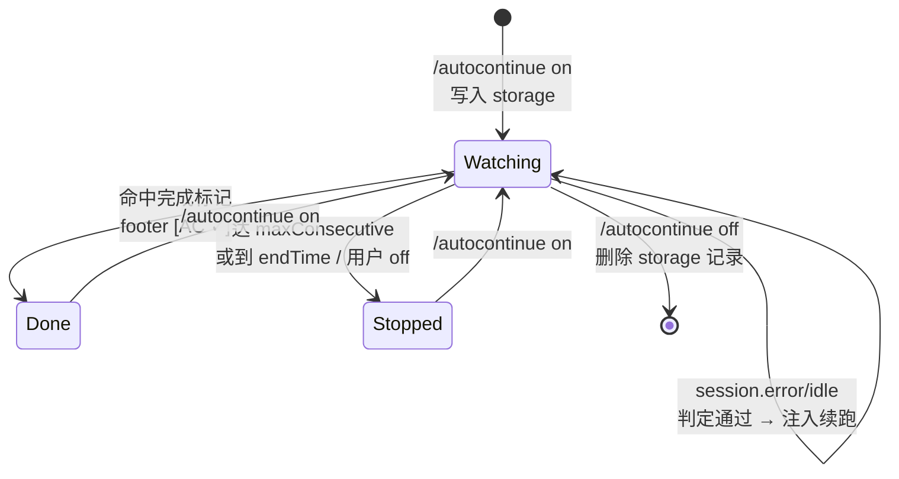
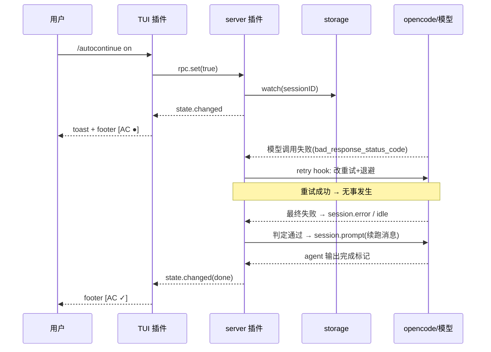

# 事件模型与状态机

## 事件词汇（已对照工作插件/真实消费者核实）

| 事件/钩子 | 用途 | 核实来源 |
|---|---|---|
| `ctx.session.hook("retry", e=>e.decision)` | 改瞬时错误的 retry 决策（第一道防线） | open-grok-build、blacktower、cortexkit harness |
| `ctx.session.prompt({sessionID, text})` | 注入续跑消息 | open-code-review、dynamic-context-pruning |
| `ctx.event.subscribe({signal})` | 事件流订阅（server 侧） | herdr-agent-state |
| `ctx.storage.get/set(key, val)` | 值守名单持久化 | CodeNomad、OrbitStart、finchtoys |
| `ctx.rpc.register(contract, impl)` | RPC 注册（server↔TUI） | dynamic-context-pruning |
| `session.status` | 跟踪 busy/idle，防在运行中注入 | herdr-agent-state |
| `session.error` | 会话级错误（含 provider error）→ 记 pendingContinue | herdr-agent-state |
| `session.idle` | 空闲（阶段完成/停摆）→ 触发续跑判定 | herdr-agent-state |
| `session.deleted` | 清理会话状态 | herdr-agent-state |
| `message.updated` | 兜底：assistant 消息带 error / 含完成标记 | usage-meter（legacy 兜底） |
| `context.data.on(type, handler)` | TUI 侧事件订阅（返回退订函数） | usage-meter |
| `session.execution.started/succeeded/failed/interrupted` | TUI 侧回合生命周期（备选信号） | usage-meter |

## 事件解析（src/events.ts）

- `sessionIDFromEvent` 双兼容：V2 事件 `event.sessionID` 平铺 / 嵌套兼容
- error 提取：从 `session.error` / assistant 消息错误载荷取错误文本，归一为 `name: message (status: N)`（status 存在时拼入，纯 5xx 裸状态也能匹配 `errorPatterns`）
- 完成标记正则：编译 `completionMarkers` 或 `markerRegex`，匹配 assistant 文本；**空 `completionMarkers` 返回 null matcher**（不检测完成，会话持续值守）

## 状态数据结构

server storage（`ctx.storage.set/get`，跨重启）：

```json
{
  "watched": {
    "ses_xxx": {
      "since": 1730000000000,
      "consecutive": 3,
      "lastInjectedAt": 1730000060000,
      "state": "watching|stopped|done"
    }
  }
}
```

- `watched` 键由 `/autocontinue on` 写入、`off` 删除
- `consecutive` 在真实用户消息/完成任务时归零
- 内存态另含 `inFlight` / `pendingContinue` 锁（不持久化）

## 状态机



## 交互时序



## 防重 / 防冲突

- **单实例续跑**：同一会话同一时刻只允许一个在途注入（`inFlight` 锁）
- **双事件防重**：`session.error` 与 `message.updated(error)` 可能同时来，用 `pendingContinue` 去重，只在 idle 时统一发送
- **不打断运行中会话**：`session.status` 非 idle 时绝不注入，轮询等待